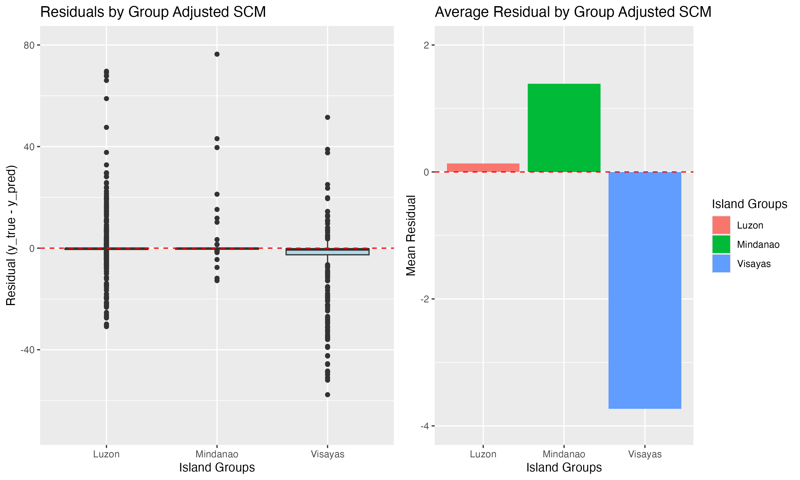
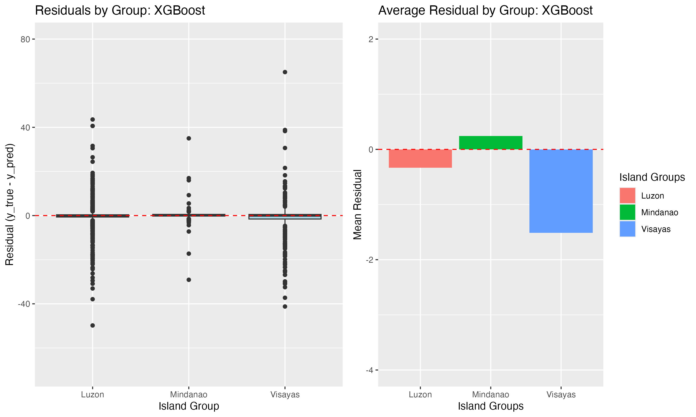
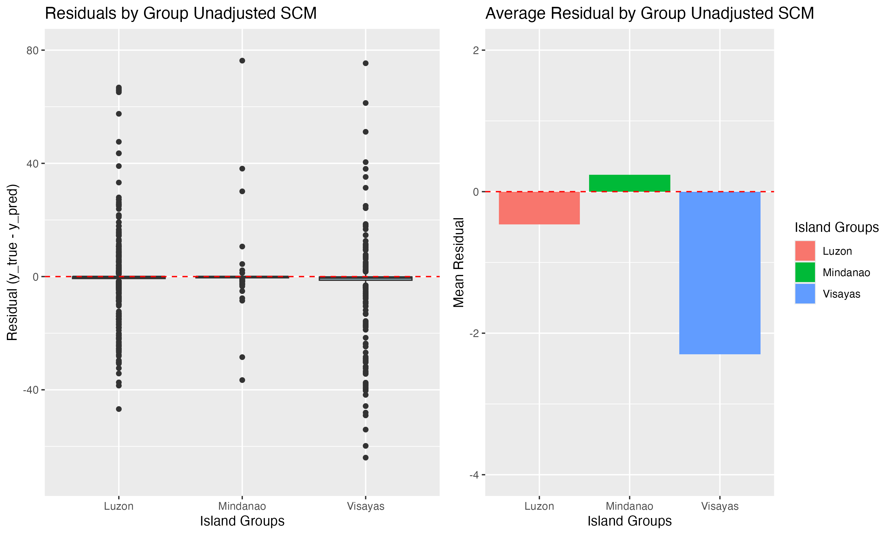

# Causal Models and Counterfactuals to Detect Biases in Predicting Impact of Tropical Cyclones in the Philippines.

## Description:
This project aims to use causal reasoning and models to identify potential biases while using machine learning to predict impact of tropical cyclones in the Philippines. The concerns for biases come from the spatial opposing gradients problem whereby the Northern region of the Philippines expereinces more tropical cyclones compared to the southern regions while southern regions exhibit more socio-economic vulnerability (Baldwin et al., 2023) and also increasing housing vulnerability because of building typologies used (Healey et al., 2022). This implies that there is a potenial regional confounder that determines which regions are frequented by tropical cyclones and which regions are physically vulnerable (both in terms of geography and building types used). The main concern is that traditional models might underestimate damage in vulnerable regions (Visayas and Mindanao) while overstimating damage in Luzon which is less vulnerable but most frequented; essentially equating storm frequency to potential for high damage. 

We implement three models, two causal models based on directed acyclic graphs (DAGs) and structural causal models (SCMs), and one traditonal associational model based on XGBoost. One causal model is adjusted for the regional confounder that accounts for the spatial opposing gradients problem. The unadjusted SCM model is a causal surrogate of the associationall XGBoost model.

## Results 
### Overall Accuracy and Metrics (Classification Step)

Overall accuracy and metrics for the positive class (damage % > 10) in causal binary classifier for the regionally adjusted model (Adjusted SCM), unadjusted model (Unadjusted SCM), and associational XGBoost.

| **Metric** | **Adjusted SCM** | **Unadjusted SCM** | **Associational XGBoost** |
|-------------|------------------|--------------------|----------------------------|
| **Accuracy**  | 0.94 | 0.93 | 0.95 |
| **Recall**    | 0.56 | 0.54 | 0.60 |
| **Precision** | 0.44 | 0.39 | 0.56 |
| **F1**        | 0.50 | 0.45 | 0.58 |

### Comparison of Binned RMSE Metrics (Regression Step)

Comparison of binned RMSE metrics on the test set across different modeling approaches.  
The **Unadjusted SCM** refers to the Structural Causal Model (SCM) excluding regional influences, thereby requiring no confounder adjustment.  
The **Adjusted SCM** incorporates regional confounding factors to estimate causal effects more accurately.  
In contrast, the **Associational XGBoost** represents a non-causal, predictive model that does not account for confounding variables.

| **Bin Interval** | **Adjusted SCM** | **Unadjusted SCM** | **Associational XGBoost** |
|:------------------|:----------------:|:------------------:|:--------------------------:|
| [0, 0.00009]      | 0.97  | 1.00  | 1.05  |
| (0.00009, 1]      | 7.68  | 8.34  | 3.99  |
| (1, 10]           | 13.03 | 13.92 | 10.69 |
| (10, 50]          | 13.95 | 13.75 | 12.63 |
| (50, 100]         | 41.92 | 46.31 | 23.08 |
| **Weighted Avg.** | **5.80** | **6.12** | **4.30** |
| **Total Features**| **21** | **20** | **20** |

#### Residual plots

### Median Counterfactual Results (Unfixed Secondary Hazards)

Median counterfactual results with unfixed secondary hazards.  
Clusters are based on building typology variables, storm surge and landslide risk scores are derived using the K-Means algorithm with *k = 5*.  
Used maximum wind speed, rainfall, and minimum observed distance of **Typhoon Melor (2015)**.

| **Cluster** | **Adjusted SCM – Luzon** | **Adjusted SCM – Visayas** | **Adjusted SCM – Mindanao** | **Unadjusted SCM – Luzon** | **Unadjusted SCM – Visayas** | **Unadjusted SCM – Mindanao** | **Associational XGBoost – Luzon** | **Associational XGBoost – Visayas** | **Associational XGBoost – Mindanao** |
|:-------------|:------------------------:|:---------------------------:|:----------------------------:|:---------------------------:|:-----------------------------:|:------------------------------:|:----------------------------------:|:-----------------------------------:|:------------------------------------:|
| **Cluster 1** | 12.7 | 27.10 | 9.92 | 15.60 | 6.36 | 19.60 | 13.2 | 8.14 | 21.0 |
| **Cluster 2** | 3.51 | 28.10 | 17.10 | 3.22 | 35.00 | 26.80 | 5.10 | 6.53 | 31.9 |
| **Cluster 3** | 7.28 | 37.10 | 9.19 | 18.80 | 28.00 | 13.30 | 19.90 | 25.70 | 9.45 |
| **Cluster 4** | 19.60 | 38.70 | 32.60 | 17.00 | 38.40 | 32.90 | 32.80 | 35.90 | 13.80 |
| **Cluster 5** | 1.73 | 28.40 | 7.95 | 2.00 | 5.70 | 4.35 | 3.82 | 4.04 | 5.77 |

### Discussion (Is there a bias?)
Adjsuting for the regional confounder shows that the models tend to over-estimate damage in Visayas region compared to the unadjusted causal model and the traditional XGBoost model. While this is indeed a bias, it begs the question whether this overestimation is unjustiifable. It turns out that the geography of the Visayas region being majorly coastal and more unsheltered from tropical storms increases the potential for damage. Under counterfactual conditions we do not know what the damage should be and therefore have to make a value judgements on which model to use. 

## References:
1. Baldwin, J. W., Lee, C. Y., Walsh, B. J., Camargo, S. J., & Sobel, A. H. (2023). Vulnerability in a tropical cyclone risk model: Philippines case study. Weather, climate, and society, 15(3), 503-523.

2. Healey, S., Lloyd, S., Gray, J., & Opdyke, A. (2022). A census-based housing vulnerability index for typhoon hazards in the Philippines. Progress in disaster science, 13, 100211.