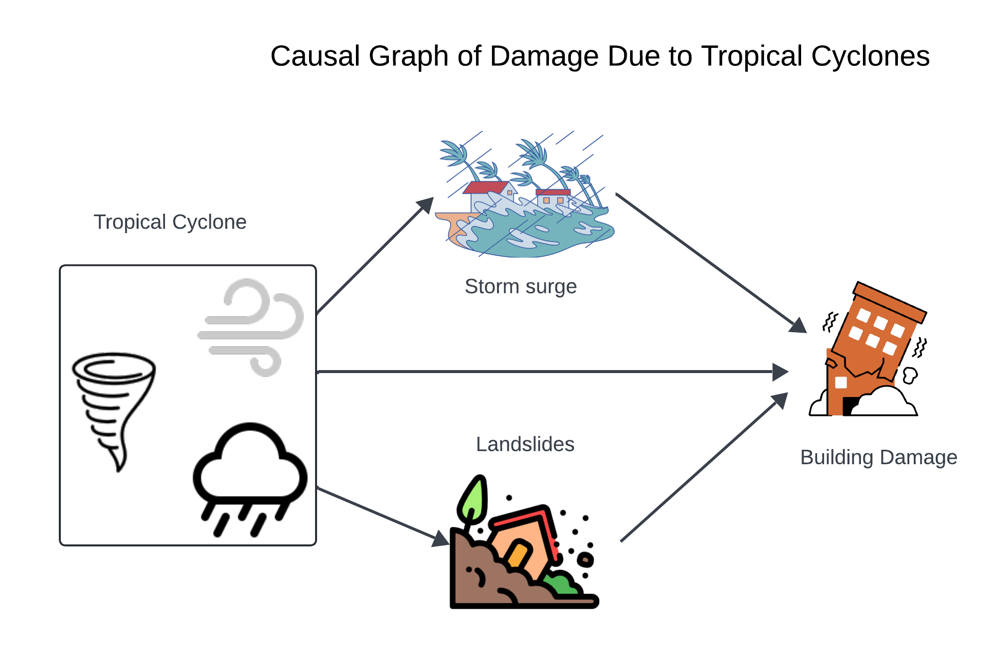

# Causal Models and Counterfactuals to Detect Biases in Predicting Impact of Tropical Cyclones in the Philippines.

## Description:
This project aims to use causal reasoning and models to identify potential biases while using machine learning to predict impact of tropical cyclones in the Philippines. The concerns for biases come from the spatial opposing gradients problem whereby the Northern region of the Philippines expereinces more tropical cyclones compared to the southern regions while southern regions exhibit more socio-economic vulnerability (Baldwin et al., 2023) and also increasing housing vulnerability because of building typologies used (Healey et al., 2022). 

We implement three models, two causal models based on directed acyclic graphs (DAGs) and structural causal models (SCMs), and one traditonal associational model based on XGBoost. One causal model is adjusted for the regional confounder that accounts for the spatial opposing gradients problem. The unadjusted SCM model is a causal surrogate of the associationall XGBoost model.

## Results 
### Overall Accuracy and Metrics (Classification Step)

Overall accuracy and metrics for the positive class (damage % > 10) in causal binary classifier for the regionally adjusted model (Adjusted SCM), unadjusted model (Unadjusted SCM), and associational XGBoost.

| **Metric** | **Adjusted SCM** | **Unadjusted SCM** | **Associational XGBoost** |
|-------------|------------------|--------------------|----------------------------|
| **Accuracy**  | 0.94 | 0.93 | 0.95 |
| **Recall**    | 0.56 | 0.54 | 0.60 |
| **Precision** | 0.44 | 0.39 | 0.56 |
| **F1**        | 0.50 | 0.45 | 0.58 |

### Comparison of Binned RMSE Metrics (Regression Step)

Comparison of binned RMSE metrics on the test set across different modeling approaches.  
The **Unadjusted SCM** refers to the Structural Causal Model (SCM) excluding regional influences, thereby requiring no confounder adjustment.  
The **Adjusted SCM** incorporates regional confounding factors to estimate causal effects more accurately.  
In contrast, the **Associational XGBoost** represents a non-causal, predictive model that does not account for confounding variables.

| **Bin Interval** | **Adjusted SCM** | **Unadjusted SCM** | **Associational XGBoost** |
|:------------------|:----------------:|:------------------:|:--------------------------:|
| [0, 0.00009]      | 0.97  | 1.00  | 1.05  |
| (0.00009, 1]      | 7.68  | 8.34  | 3.99  |
| (1, 10]           | 13.03 | 13.92 | 10.69 |
| (10, 50]          | 13.95 | 13.75 | 12.63 |
| (50, 100]         | 41.92 | 46.31 | 23.08 |
| **Weighted Avg.** | **5.80** | **6.12** | **4.30** |
| **Total Features**| **21** | **20** | **20** |

Classification metrics for adjusted SCM:

├── adjusted SCM/

│	├── xgb classifier and training/

│	│	└── adj_scm_testing_xgb_classifier.pdf

Classification metrics for unadjusted SCM:

├──  unadjusted SCM/

│	└── unadj_scm_testing_xgb_classifier.pdf

Classification metrics for associational XGBoost:

├──  associational XGBOOST/

│	└── model___training_xgb_classifier.pdf

### Hurdle Testing: Binned metrics
These are the resutls for Table 4 in the manuscript

Binned metrics for adjusted SCM:

├──  adjusted SCM/

│	├──  hurdle testing/

│	│	└── adj_scm_hurdle_testing.pdf

Binned metrics for unadjusted SCM:

├── unadjusted SCM/

│	└── unadj_scm_hurdle_testing.pdf

Binned metrics for associational XGBoost:

├── associational XGBOOST/

│	└── model___hurdle_testing.pdf

### Counterfactuals
Results to Table 5 counterfactuals based on clusters:

adjusted SCM Table 5 results:
├── adjusted SCM/

│	├── counterfactuals/

│	│	└── adj_scm_counterfactual2.pdf

unadjusted SCM Table 5 results:
├──  unadjusted SCM/

│	└── unadj_scm_counterfactual_2.pdf

associtional XGBoost Table 5 results:
├──  associational XGBOOST/

│	└── ass___counterfactual_testing2.pdf

Results for Table 6 to 9 adjusted SCM:

├── adjusted SCM/

│	├── counterfactuals/

│	│	└── adj_scm_counterfactuals_fixed.pdf # Table 6 results

│	│	└── adj_scm_counterfactuals_fixed.Rmd # Table 8 results (Note this is the .Rmd file and not the pdf file)

Results for Table 6 to 9 unadjusted SCM:
├──  unadjusted SCM/

│	└── unadj_scm_counterfactuals_fixed.Rmd # Table 8 & 9 results

Results for Table 6 to 9 Associtional XGBoost:

├──  associational XGBOOST/

│	└── ass_counterfactuals_fixed.Rmd # Results for Table 9

## References:
1. Baldwin, J. W., Lee, C. Y., Walsh, B. J., Camargo, S. J., & Sobel, A. H. (2023). Vulnerability in a tropical cyclone risk model: Philippines case study. Weather, climate, and society, 15(3), 503-523.

2. Healey, S., Lloyd, S., Gray, J., & Opdyke, A. (2022). A census-based housing vulnerability index for typhoon hazards in the Philippines. Progress in disaster science, 13, 100211.